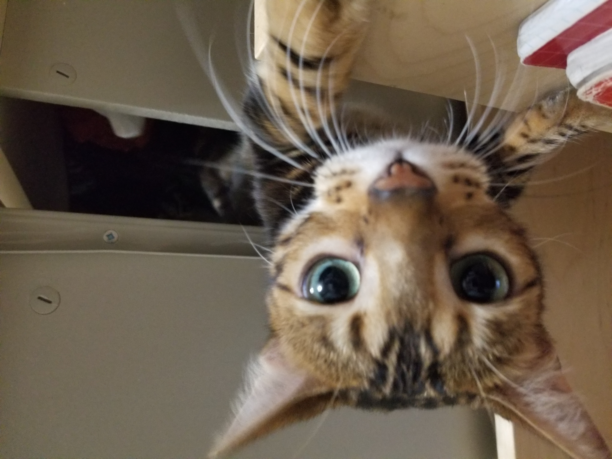
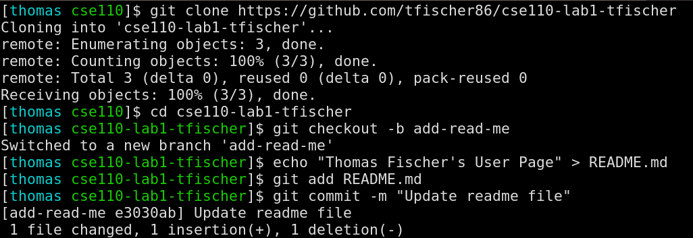
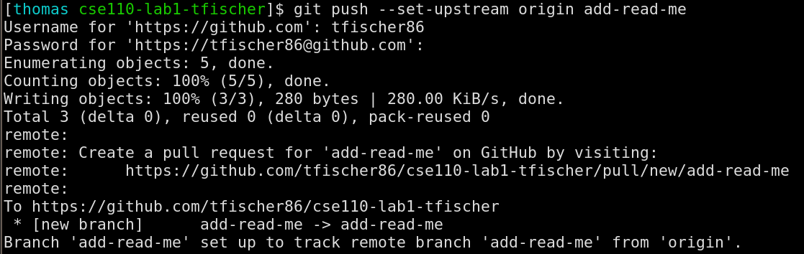
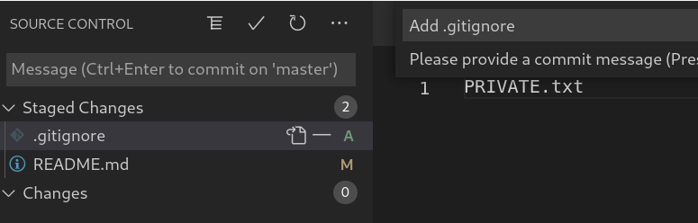

# Welcome to Thomas's *Epic Gamer* Website

A place to show off my `Markdown` skills.

<details>
    <summary> Hello </summary>
    If you're reading this have a great day.
</details>


Goals for CSE110

- [X] Have fun learning new things
- [ ] Learn Software Engineering
- [ ] Make an awesome group project

[← Back to Readme](README.md)

## Table of Contents
1. [Programming](#programming)
2. [Important Image](#important-image)


## Programming

```c
#include <stdio.h>

int main(int argc, char *argv[])
{
    puts("Hello World!");
}
```

I've been ~~programming~~ since I was around 8 years old, but I wouldn't call it programming - more like copying and pasting Visual Basic scripts and seeing what happened when I changed things. I only started to understand what I was doing after I read a book about python in 5th grade.

I really started to enjoy programming when I realized I could use it to make games. Minecraft was really popular back then, and it was amazing to me that [Markus "Notch" Persson](https://en.wikipedia.org/wiki/Markus_Persson) had created the game basically on his own, using Java. I didn't have any books about Java, so I learned by watching an hour-long tutorial for setting up Eclipse, and then watching one of Notch's livestreams, in which he created a game for a game jam called Ludum Dare. I paused the livestream every few seconds and copied what Notch wrote, slowly figuring out what parts of the code did. In hindsight this was a really inefficient way to learn, but I eventually found tutorials and books which helped me figure out what I was doing. A few years later, I branched out to C/C++ to use OpenGl.

I've played around with a bunch of languages since I started programming, but I tend to use only a handful of them on a daily basis.

### Languages that I can use comfortably:
 - C
 - C++
 - Python 3
 - Java
 - Bash
 - Perl
 - Lisp

## Important Image



## Lab Screenshots




